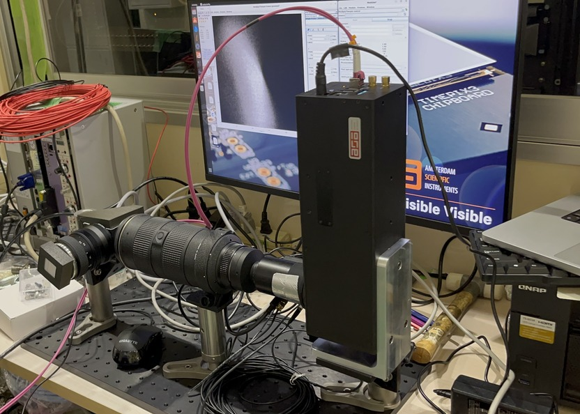
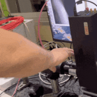
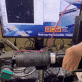
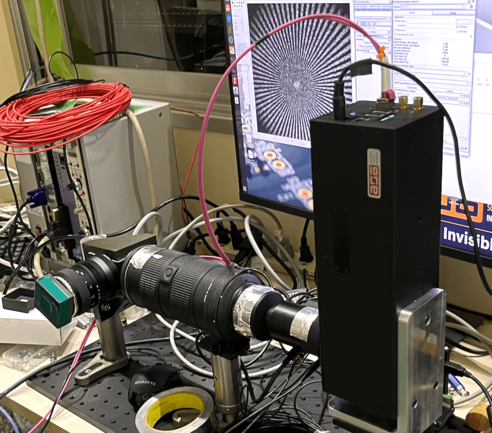
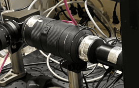
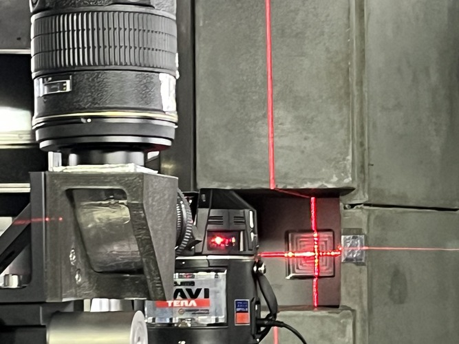

# Timepix Detector

Timepix detector uses a scintilator to detect neutrons.
A scintilator is attached to a :math:~`45 \degree` tilted mirror.

## Parameters

Here is the list of parameters that may affect later computational processes.

- Aperture of each lenses
- Gain of the image intensifier
- Photon-to-neutron parameters
  - Minimum number of photons to reconstruct neutrons with
  - Time window of clustering photons
  - Spatial clustering range of photons

## Example Experiment set-up with Timepix Detector (June. 2024 @ JParc, SENJU)

### Overview of the detector, sample set-up
  

### Preparation
1. Mount detector components on a board.

   

2. **EXCEPT FOR THE IMAGE INTENSIFIER**, connect powers/communication cables.

    

3. Block leaking lights

    Make sure there is no leaking light using real-time time-pix monitor.

    You can use `SoPhy` to monitor the image taken by the timepix in real-time.

    

    > `SoPhy` is written by [Amsterdam Scientific Instrument](https://www.amscins.com/)
    > but I couldn't find the documentation online.

    This time, wrapping aluminium tape was enough.

    

4. Focusing

    Focusing should be done in an order from the time-pix body to the scintilator mount.

    All the apertures should be fully-open at the beginning
    since it is easier to see the effect of focusing when they are wider.

    

    Each group of signals should shrink like the picture above as focusing is optimized.

    

    You can also use a complicated pattern like `Siemens Star` to adjust the focus.

    

    Once focusing is done, gently fix the lenses with i.e. aluminium tape.

5. Intensity saturation of image intensifier

    We need to find the intensity saturating points of the image intensifier.

    Use `Zabier` to control the gain of the `image intensifier`.

    **After making sure** that the lens is not exposed to the direct light, plug the power to the `image intensifier`.

    Good starting gain is `0.6` and repeat a measurement until you find the saturating point.

6. Attach scintilator

    Carefully attach the scintilator to the direct lens, that will be facing the beam.

    > Scintilator may move while changing surroundings,
    > i.e. sample, or drift during the measurement for some reason.
    > It can affect the background normalization since scintilator doesn't have a constant spatial efficiency.
    > Secure the scintilator as much as possible once it is mounted as you want.

7. Align with the beam

    Align the center of the lens and scintilator to beam.

    

    There should be enough space for a sample and a shield (if applicable).

### Open beam measurement (Background)

### Siemens Star (Spatial Resolution)

### Sample Measurement (Signal)

### Trouble Shooting
- Scintilator
  The scintilator angle is not important as long as it stays the same position throughout the background/signal measurement.
  However, it limited the space to mount a sample rotation station in this experiment.
  The sample couldn't get close enough to the scintilator.
  Therefore we had to use a tilted holder to mount the sample rotating station.

- Detector Component Displacement
  The scintilator was accidentally displaced while mounting the sample.
  Therefore the background image had to be aligned first.
  See [Image Alignment](../user-guide/image_alignment.ipynb) for more detail.
