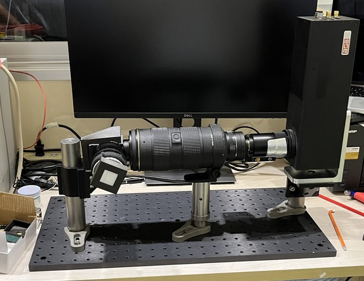
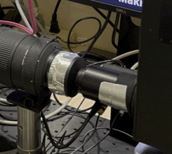

# Timepix Detector

Timepix detector uses a scintilator to detect neutrons.
A scintilator is attached to a $45 \degree$ tilted mirror.

## Parameters

Here is the list of parameters that may affect later computational processes.

- Aperture of each lenses
- Gain of the image intensifier
- Photon-to-neutron parameters
  - Minimum number of photons to reconstruct neutrons with
  - Time window of clustering photons
  - Spatial clustering range of photons

## Example Experiment set-up with Timepix Detector (June. 2024 @ JParc, SENJU)

### Overview of the detector, sample set-up
  

### Preparation
1. Mount detector components on a board.

   

2. **EXCEPT FOR THE IMAGE INTENSIFIER**, connect powers/communication cables.

    

3. Block leaking lights

    Make sure there is no leaking light using real-time time-pix monitor.

    You can use `SoPhy` to monitor the image taken by the timepix in real-time.

    

    > `SoPhy` is written by [Amsterdam Scientific Instrument](https://www.amscins.com/)
    > but I couldn't find the documentation online.

    This time, wrapping aluminium tape was enough.

    

4. Focusing

    Focusing should be done in an order from the time-pix body to the scintilator mount.

    All the apertures should be fully-open at the beginning
    since it is easier to see the effect of focusing when they are wider.

5. Image intensifier gain

    **After making sure** that the lense is not exposed to the direct light, plug the power to the `image intensifier`.

6. Attach scintilator

7. Align with the beam

### Open beam measurement (Background)

### Sample Measurement (Signal)

### Trouble Shooting
- Scintilator
  The scintilator angle is not important as long as it stays the same position throughout the background/signal measurement.
  However, it limited the space to mount a sample rotation station in this experiment.
  The sample couldn't get close enough to the scintilator.
  Therefore we had to use a tilted holder to mount the sample rotating station.

- Detector Component Displacement
  The scintilator was accidentally displaced while mounting the sample.
  Therefore the background image had to be aligned first.
  See [Image Alignment](../user-guide/image_alignment.ipynb) for more detail.
